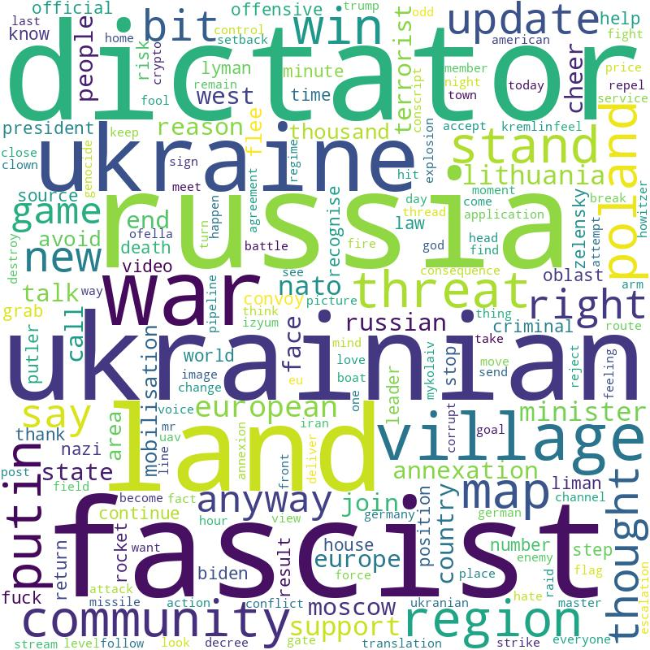
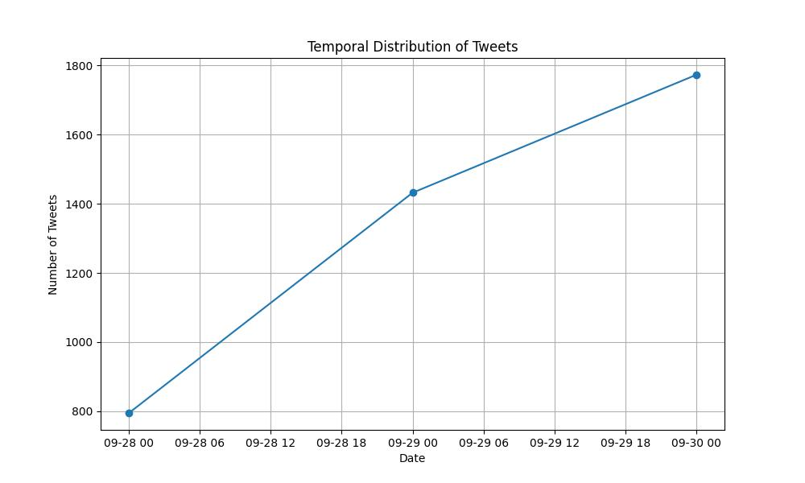

# Twitter Data Analysis with NLP

This project focuses on performing Natural Language Processing (NLP) on Twitter data, including preprocessing text and data analysis. The project is implemented in Python3 and relies on various libraries for NLP and data visualization.

## Prerequisites

Before running the code, make sure you have the required Python libraries installed. You can install them using pip:

```bash
pip install nltk wordcloud matplotlib pandas numpy 
```
## Usage
### Main Script: 
The primary functionality is implemented in the main() function within main.py.


To run the project, execute the following command:

```bash
python3 main.py
```

## Dependencies 
The project relies on the following Python libraries:
- NLTK (Natural Language Toolkit)
- WordCloud
- Matplotlib
- Pandas
- NumPy
<br></br>

## Results 

### WORD CLOUD



### TWEET LENGTH DISTRIBUTION


### TEMPORAL ANALYSIS



## Authors
- Núria Codina 
- Maria Guasch 
- MArtina Gómez 
